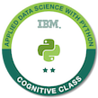



# My Online Course Certificates

Here are some of the certificates I have earned through various online learning platforms.

<!-- ## Certifications -->

<h1 align="center"> Certifications </h1>
<table>
  <tr>
    <td width="80%">
      <b>Logistic Regression in R for Public Health</b> | December 2022   
     Offered By: Imperial College London  
     Learning Platform :  <a href="https://www.coursera.org/learn/logistic-regression-r-public-health">Coursera</a> 
     <a href="https://www.coursera.org/account/accomplishments/verify/MXSMDK4LPKRX">View Certificate</a>
    </td>
    <td><image src="../images/image.png" alt="LR in R" /></td>
  </tr>
        

 <tr>
    <td width="80%">
      <b>Applied Data Science with Python Level 2</b> | December 2021   
     Offered By: IBM  
     Learning Platform :  <a href="https://www.cognitiveclass.ai">CognitiveClass.ai</a> 
     <a href="https://www.credly.com/badges/813ee73d-fe40-49c7-85d0-b7f193a4c195/public_url">View Certificate</a>
    </td>
    <td><image src="../images/applied-data-science-with-python-level-2.png" alt="IBM badge 1" /></td>
  </tr>

  <tr>
    <td width="80%">
      <b>Applied Data Science with Python Level 2</b> | December 2021   
     Offered By: IBM  
     Learning Platform :  <a href="https://www.cognitiveclass.ai">CognitiveClass.ai</a> 
     <a href="https://www.credly.com/badges/813ee73d-fe40-49c7-85d0-b7f193a4c195/public_url">View Certificate</a>
    </td>
    <td><image src="../images/applied-data-science-with-python-level-2.png" alt="IBM badge 1" /></td>
  </tr>       

</table>

### Coursera

#### Applied Data Science with Python Level 2

    

        
    

    

        
<strong>By: IBM on CognitiveClass.ai</strong>

        
<a href="https://www.credly.com/badges/813ee73d-fe40-49c7-85d0-b7f193a4c195/public_url">View Certificate</a>

    

